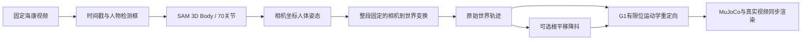

# 海康单目人体运动重建与 Unitree G1 重定向

将**固定海康相机录制的单目视频**转换为 SAM 3D Body 人体姿态、固定参考世界坐标轨迹和宇树 G1 的 MuJoCo 运动学参考，最后渲染人体与机器人同步对照视频。

项目已在两段真实海康视频上完成本地推理、重建、重定向和渲染。主展示为 **1600 × 1000 / 30 FPS**：左侧真实视频叠加人体骨架，右侧 G1 回放，附人体和机器人骨盆轨迹、地面投影及 XY 轨迹图。

**当前结果使用未标定的单目模型尺度；尚未验证米制世界精度、真实回环误差或机器人动态行走能力。** 本项目输出可供后续模仿学习筛选的运动学参考，当前不包含训练完成的行走策略。

## 1. 从哪里开始

| 目的 | 入口 |
| --- | --- |
| 零基础理解与操作 | [完整中文说明书](docs/SAM3D_零基础完整说明书.md) |
| 查看本次实测结果和局限 | [结果报告](RESULTS_CN.md) |
| 快速运行说明 | [原中文运行说明](README_CN.md) |
| 查看世界坐标定义 | [世界重建审查](docs/world_reconstruction_audit.md) |
| 理解尺度与训练问题 | [焦距、深度和训练说明](docs/monocular_focal_depth_and_training.md) |
| 修改 G1 重定向 | [重定向模块说明](retarget/README.md) |
| 修改对照视频 | [渲染模块说明](visualization/README.md) |
| 恢复 SAM 源文件中文注释 | [源码注释补丁](patches/sam3d_chinese_comments/README.md) |

Git 仓库保存适配源码、Markdown、依赖版本、测试、G1 模型资源及 SAM 注释补丁。原始视频、推理权重、生成结果和运行环境在独立完整交付包中；克隆代码仓库不会自动获得这些大文件。手册中引用的结果图片也需要交付包中的 `outputs/`。

## 2. 算法流程



1. **抽帧与检测**：保留源视频帧号和 ffprobe 时间戳；YOLO 提供人物框，利用框位置连续性选择主要人物。这不是多人身份跟踪器。
2. **人体推理**：调用用户原复现包中的官方 SAM 3D Body、DINOv3 和 MHR，使用 body 模式输出 70 关节及图像投影。
3. **固定世界重建**：整段视频使用同一个尺度、旋转和平移，建立右手、Z 向上的参考坐标。没有标定时，从人体上方向和候选低足点推断展示地面。
4. **可选时序处理**：仅修正人体整体根平移，各关节使用相同平移增量，保留每帧相对姿态；原始数据同时保存，无效间隙不拼接。
5. **G1 重定向**：采用官方 29 自由度模型，在关节限位内做雅可比逆运动学。保留人体骨盆世界 XY，用固定比例适配机器人高度，输出关节角和速度。
6. **可视化与审查**：显示两侧运动及骨盆空间轨迹，记录穿地、速度、接触候选和端点距离，保留来源与文件校验信息。

这是固定相机的单目适配流程，不使用原 ZED 数据的 IMU、双目深度或动态相机位姿。

## 3. 源码结构

```text
hik_g1/
├── README.md                         项目总览
├── infer_hik.py                      抽帧、人物框、SAM 人体推理
├── run_pipeline.py                   完整流水线入口
├── reconstruction/
│   ├── fixed_camera_world.py         固定世界变换与轨迹统计
│   └── temporal_root.py              根平移时序降抖
├── retarget/
│   ├── world_to_g1.py                人体到 G1 的运动学重定向
│   ├── audit_motion.py               运动质量审查
│   └── contact_diagnostics.py        接触候选与速度筛查
├── visualization/
│   └── render_comparison.py          人体 / G1 同步对照视频
├── assets/unitree_g1/                XML、网格、来源与原始许可
├── patches/sam3d_chinese_comments/   SAM 两个核心文件的中文注释补丁
├── docs/                            零基础手册与算法说明
├── requirements.lock.txt            本机依赖版本记录
├── environment_versions.json        主要库版本
├── verify_delivery.py               本次两段交付数据的契约检查
├── package_results.py               轻量结果包生成器
└── package_full_delivery.py          源码、权重和视频完整包生成器
```

运行时还会使用 `.venv/`、`outputs/`、`logs/`、`delivery/` 等目录，这些不纳入 Git。

## 4. 环境与外部资源

本机已验证环境：Windows、Python 3.11、NVIDIA RTX 5060 Laptop 8 GB、PyTorch `2.8.0+cu128`、torchvision `0.23.0+cu128`、MuJoCo `3.3.7`。完整版本见 [依赖记录](requirements.lock.txt)。该文件记录本次运行环境，不保证在不同系统或显卡驱动上直接安装即兼容。

`ffmpeg` 和 `ffprobe` 必须在 PATH 中。推理入口使用 CUDA，当前没有验证纯 CPU 的完整人体推理。

### 必须保留的相邻目录

当前 `infer_hik.py` 按下面的相对位置读取官方源码和权重：

```text
工作目录/
├── hik_g1/                          本仓库
│   └── assets/yolo11n.pt            人物检测权重，另行放置
└── pose_world_sam3d_repro_20260918/
    └── pose_project/sam3d/
        ├── repo/                   官方 SAM 3D Body 源码
        ├── dinov3_official/         官方 DINOv3 源码
        └── checkpoints/user_dinov3_20260917/
            ├── model.ckpt
            ├── model_config.yaml
            └── assets/mhr_model.pt
```

使用完整交付包时，保持上述兄弟目录关系即可。单独克隆本仓库时，需要另外恢复官方源码和已获授权的模型资源；本仓库不内置这些权重。检测权重的来源及校验值见 [YOLO 资源说明](assets/YOLO_WEIGHTS.md)。

SAM 3D Body 基准 commit：`b5c765a0d89d789985e186d396315e7590887b94`；DINOv3 基准 commit：`6876159a11b4df116f30f667f8c9888617df0751`。中文注释补丁不改变模型计算逻辑，使用前按补丁说明核对文件哈希。已经带有注释的完整包无需重复应用。

### 已有环境的快速检查

在 `hik_g1` 目录打开 PowerShell：

```powershell
.\.venv\Scripts\python.exe -c "import torch, mujoco; print('torch:', torch.__version__); print('CUDA:', torch.cuda.is_available()); print('MuJoCo:', mujoco.__version__)"
ffmpeg -version
ffprobe -version
.\.venv\Scripts\python.exe run_pipeline.py --help
```

新机器需先创建 Python 3.11 环境，安装与驱动兼容的 PyTorch CUDA 版本，再按依赖记录配置其余库。完整交付包不包含 `.venv`；详细步骤与常见报错见零基础说明书。手册 HTML 生成和浏览器排版检查另外依赖 Node.js、marked、Playwright，属于可选文档工具。

## 5. 运行自己的视频

以下命令在 `hik_g1` 目录执行；将视频路径替换为实际文件。修改代码、权重、标定或抽帧设置后，应使用新的输出目录，避免误复用旧缓存。

先试跑最多 120 个采样帧：

```powershell
.\.venv\Scripts\python.exe run_pipeline.py `
  --video "D:\captures\walking.avi" `
  --output "outputs\walking_trial" `
  --stride 4 --max-frames 120
```

完整运行：

```powershell
.\.venv\Scripts\python.exe run_pipeline.py `
  --video "D:\captures\walking.avi" `
  --output "outputs\walking_full" --stride 4
```

`--max-frames` 指抽取后的采样数。对约 60 FPS 的源视频，`--stride 4` 对应约 15 Hz 推理；30 FPS 成片通过重复匹配的左侧源帧和右侧姿态插值得到，不等于 30 Hz 独立观测。

| 参数 | 用途 |
| --- | --- |
| `--intrinsics path.json` | 指定相机内参 |
| `--world-calibration path.json` | 指定固定相机到世界变换 |
| `--metric-scale 数值` | 指定正的全局尺度系数；仍需实测依据 |
| `--raw-only` | 跳过根平移降抖，输出原始全景 `comparison_raw.mp4` |
| `--overview` | 使用固定全景视角 |
| `--skip-prepare --skip-infer` | 复用该输出目录已有的人体相机坐标结果 |

仅设置 `--skip-infer` 仍会执行准备步骤；复用已有推理应同时指定两个跳过参数。默认输出 `comparison.mp4` 使用原相机 K/T 对齐的固定视角；若平移降抖候选未通过门限，保留原始世界数据渲染。

## 6. 输出文件

| 相对输出目录的文件 | 内容 |
| --- | --- |
| `camera/camera_sequence.npz` | 相机坐标人体关节、原始 2D 投影、时间戳与有效位 |
| `world/world_joints.npz` | 原始固定世界人体关节与坐标变换信息 |
| `world_temporal/world_joints.npz` | 时序候选、原始关节和根平移修正量 |
| `world_temporal/temporal_report.json` | 候选选择与门限报告 |
| `g1_motion.npz` | 原始人体输入对应的 G1 运动 |
| `g1_motion_temporal.npz` | 通过筛选的时序候选对应的 G1 运动 |
| `comparison.mp4` | 主对照成片 |
| `comparison_raw.mp4` | `--raw-only` 生成的原始全景成片 |

G1 的 `qpos[T,36]` 为根平移 xyz、根四元数 **wxyz** 和 29 个弧度制关节角。`qvel[T,35]` 是 MuJoCo 切空间速度；关节顺序以输出中的 `joint_names` 为准。缺测通过 `valid` 显式表示，不能把缺测当静止站立。

接触诊断、运动审查和成片解码检查有独立脚本与报告，并非全部由 `run_pipeline.py` 自动执行。字段细节见模块说明和零基础说明书。

## 7. 世界坐标与回环的正确解释

本项目采用：

```text
P_world = R_world_from_camera @ (metric_scale * P_camera) + t_world_from_camera
```

同一片段内 `R`、`t` 和尺度保持固定。未提供内参时，焦距采用图像对角线长度、主点采用图像中心；未提供外参时，地面和原点由该片段估计。因此输出中的“米”是模型名义单位，不代表经测量确认的物理精度，不同片段也不自动共享同一房间原点。

内参 JSON 提供 `K`（3 × 3）；非零畸变需要先去畸变，并使用对应的新内参。世界标定 JSON 提供 `T_world_from_camera`（4 × 4，右手、Z 向上），或旋转与平移字段，可附 `metric_scale`、`scale_provenance`。命令行与 JSON 同时指定尺度时必须一致。具体格式见 [世界重建说明](docs/world_reconstruction_audit.md)。

回环验收需要人物实际回到同一个已知地面位置，再评估重建偏差。本项目不会把轨迹强行拉回起点；人和 G1 的 XY 轨迹重合来自重定向设计，不能独立证明人体重建准确。

## 8. 本次真实数据结果

| 视频 | 有效采样 | 处理状态 |
| --- | ---: | --- |
| `Video_20260922162126269.avi` | 461 / 461 | 主行走片段，约 30.7 秒，已完成全流程 |
| `Video_20260922161535257.avi` | 220 / 267 | 含进出画面及缺测，已完成全流程 |
| `Video_20260922155450711.avi` | — | 多人准备场景，仅做检测审查 |

主片段的首尾骨盆直接距离约 **1.676 模型米**，首尾各 0.25 秒窗口中位位置距离约 **1.699 模型米**。视频起终点站位不同，不能将这些数值直接称为闭环漂移。

主展示的根平移降抖使骨盆加速度 P95 由约 31.58 降至 10.30 模型米/秒²；但固定支撑候选样本的 G1 脚速 P95 由约 0.228 升至 0.317 模型米/秒。视觉更平滑并不代表所有训练质量指标都更好。

完整指标与证据索引见 [RESULTS_CN.md](RESULTS_CN.md)。报告中的数据来自本次交付记录；重新运行或修改参数后应以新报告为准。

## 9. 验证与后续工作

在依赖齐全的环境中，可以运行现有的几何、间隙处理和接口测试：

```powershell
.\.venv\Scripts\python.exe reconstruction\test_fixed_camera_world.py
.\.venv\Scripts\python.exe reconstruction\test_temporal_root.py
.\.venv\Scripts\python.exe retarget\verify_retarget.py
.\.venv\Scripts\python.exe retarget\verify_contacts.py
.\.venv\Scripts\python.exe visualization\test_contract.py
```

`verify_delivery.py` 针对本次两段固定名称的交付数据检查契约和文件，需恢复对应 `outputs/`，不适合作为任意新视频的通用测试。这些检查不等同于实测姿态精度或动态稳定性验证。

用于机器人行走训练之前，需要完成相机与尺度标定、接触和滑脚审查、缺测与异常段筛选、动力学跟踪训练，以及仿真中的平衡、碰撞和力矩验收。当前没有完成这些训练与部署步骤。

## 10. 来源与许可

- SAM 3D Body：<https://github.com/facebookresearch/sam-3d-body>，使用用户复现包中的官方源码与模型资源；中文注释以补丁保存，附原始许可。
- DINOv3：<https://github.com/facebookresearch/dinov3>，由上述固定版本提供视觉骨干。
- G1：<https://github.com/unitreerobotics/unitree_mujoco>，本仓库保留 [来源清单](assets/unitree_g1/SOURCE.json)、固定 commit 和 [原始许可](assets/unitree_g1/LICENSE.unitree)。
- YOLO：<https://github.com/ultralytics/ultralytics>，只提供人物检测框；权重另行配置，来源见资源说明。

第三方源码、模型和资产分别遵循各自许可与使用条件；本项目没有用统一的新许可证覆盖它们。
